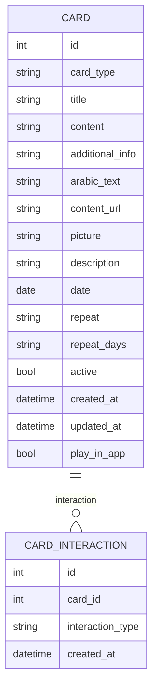

```mermaid
erDiagram
    CARD {
        int id
        string card_type
        string title
        string content
        string additional_info
        string arabic_text
        string content_url
        string picture
        string description
        date date
        string repeat
        string repeat_days
        bool active
        datetime created_at
        datetime updated_at
        bool play_in_app
    }
    
    CARD_INTERACTION {
        int id
        int card_id
        string interaction_type
        datetime created_at
    }
    CARD ||--o{ CARD_INTERACTION : "interaction"
```